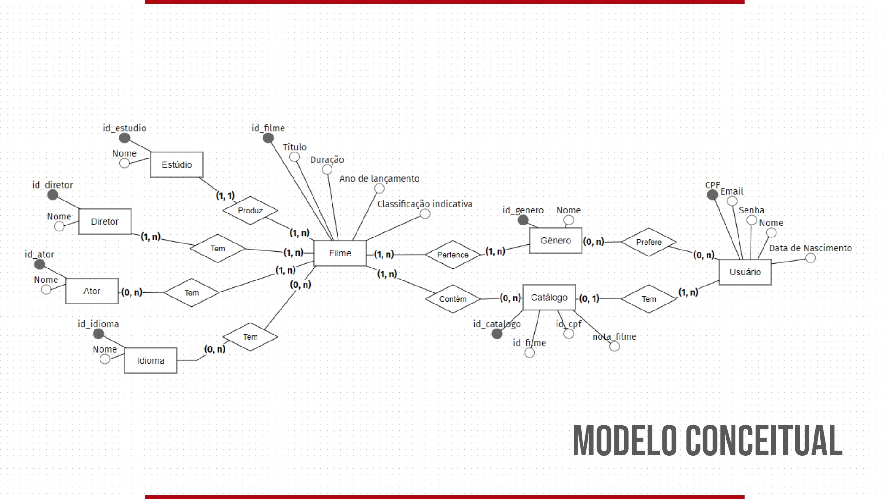
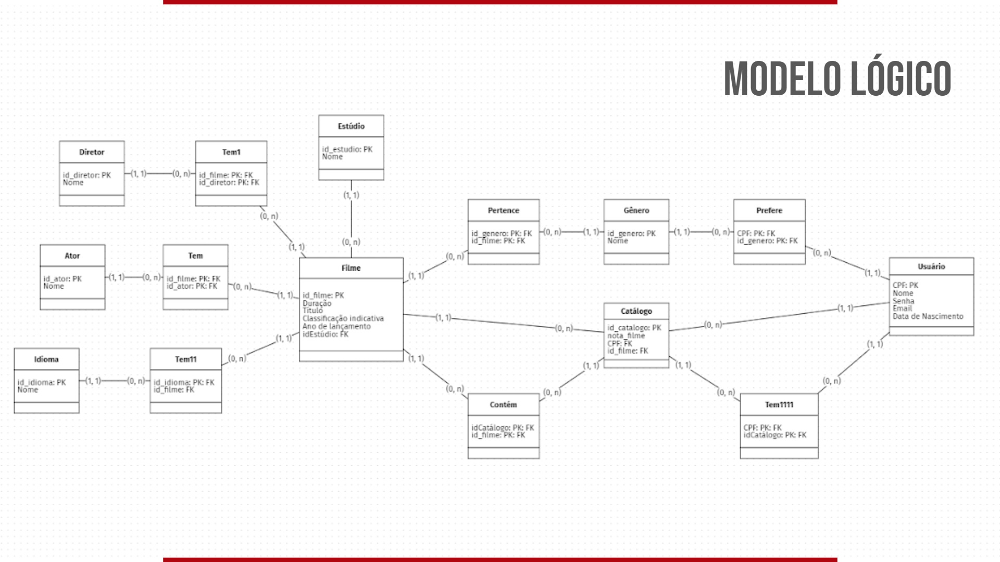
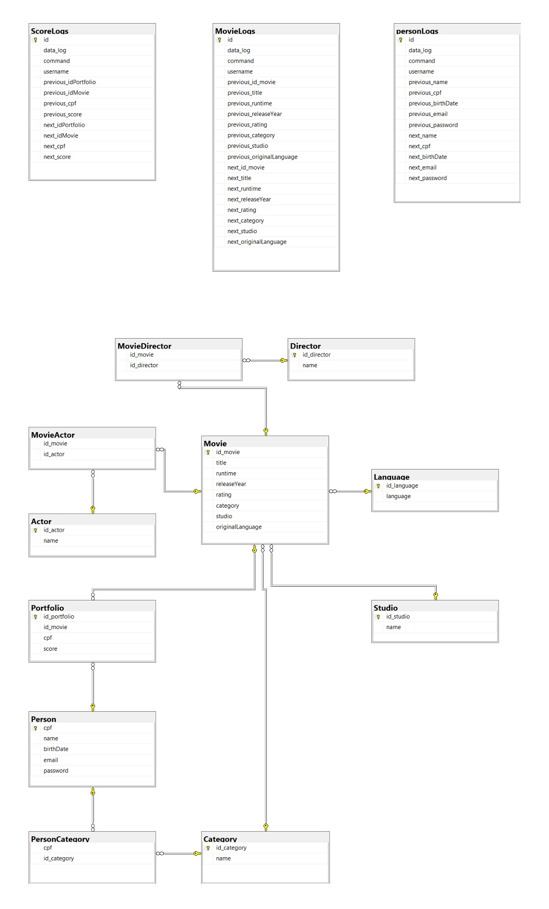

<!DOCTYPE html>
<html>
<head>
</head>
<body>
<h1 style="text-align: center;">Portf&oacute;lio Cinematogr&aacute;fico - SQL Server</h1>

&nbsp;

<h2 style="text-align: justify;">Entendendo o projeto</h2>

Como parte avaliativa do m&oacute;dulo de 'Banco de Dados', foi proposta a confec&ccedil;&atilde;o de um projeto em grupo que contivesse os t&oacute;picos desenvolvidos em aula abarcando o CRUD (<strong>C</strong>reate, <strong>R</strong>ead, <strong>U</strong>pdate and <strong>D</strong>elete). Logo, deveriam existir arquivos que criassem:

<ul style="text-align: justify;">
<li>tabelas entidades e suas respectivas chaves (PKs);</li>
<li>tabelas de relacionamento;</li>
<li>alters: constraints (PKs/FKs);</li>
<li>inserts b&aacute;sicos para todas as tabelas (que os necessitassem);</li>
<li>triggers para armazenamento de logs dos métodos (INSERT< UPDATE e DELETE);</li>
<li>funções para recebimento de tabelas filtradas;</li>
<li>formas de visualiza&ccedil;&otilde;es filtradas;&nbsp;</li>
<li>regras de tratamento de dados;</li>
<li>script - 'ReadMe' - com explica&ccedil;&otilde;es e diagramas;</li>
</ul>

<strong>O grupo ser&aacute; avaliado pela coer&ecirc;ncia do projeto e aplica&ccedil;&atilde;o dos seus conceitos vistos em aula. </strong><strong>Cada membro do grupo ser&aacute; avaliado individualmente por seus commits no reposit&oacute;rio.</strong>

Esta &uacute;ltima regra foi flexibilizada, fazendo com que fosse poss&iacute;vel cada aluno (individualmente) subir para seu pr&oacute;prio reposit&oacute;rio no github o projeto completo. Como grupo, fizemos a documenta&ccedil;&atilde;o das etapas ao longo do projeto tendo criado um cronograma com taks dedicadas que podem ser acessadas pelo link abaixo e ser direcionado para a página do projeto no <a style="color: #b96ad9;" title="Notion" href="https://www.notion.so/lumcampello/Banco-de-dados-Portf-lio-Cinematogr-fico-468a106dbb8147868e3ecd770a1638f3" target="_blank" rel="noopener"><strong>notion</strong></a>:

<blockquote>

<em><a style="color: #2dc26b;" href="https://www.notion.so/lumcampello/Banco-de-dados-Portf-lio-Cinematogr-fico-468a106dbb8147868e3ecd770a1638f3">https://www.notion.so/lumcampello/Banco-de-dados-Portf-lio-Cinematogr-fico-468a106dbb8147868e3ecd770a1638f3</a></em>

</blockquote>
  
Como forma de garantir o aprendizado de todos os membros e diminuir riscos de que algum erro passasse desapercebido, cada membro utilizava algo que foi criado por outro, de forma que isso servisse também como um teste (a divisão do trabalho se encontra no seguinte arquivo: https://raw.githubusercontent.com/luizacampello/PortfolioCinema_M04_LetsCode/master/Activities.png). O código final produzido pelos membros foi compilado em conjunto neste repositório.
<h3>&nbsp;</h3>
<h3>Como nasceu o "Portf&oacute;lio Cinematogr&aacute;fico"</h3>

Em reuni&otilde;es seriais, o grupo explorou a ideia de trabalhar com o universo cinematográfico, percebendo a dificuldade de alguns cin&eacute;filos e entusiastas em centralizar informa&ccedil;&otilde;es de filmes assistidos e suas pr&oacute;prias avalia&ccedil;&otilde;es dos mesmos, foi idealizado um banco que reunisse filmes (e suas particularidades, como atores, diretores, est&uacute;dio etc) &agrave; um portf&oacute;lio do usu&aacute;rio.&nbsp;

Seria permitido ao usu&aacute;rio criar seu cadastro (apenas 1 por CPF) com informa&ccedil;&otilde;es pessoais e de contato (que poderiam ser atualizadas posteriormente) e automaticamente seria gerado seu portf&oacute;lio ainda sem filmes vistos/avaliados. O usu&aacute;rio, ent&atilde;o, poderia buscar seus filmes de interesse no banco a partir do t&iacute;tulo, g&ecirc;nero, idioma, dura&ccedil;&atilde;o e etc. O banco devolve para o usu&aacute;rio uma lista de filmes dentro da classifica&ccedil;&atilde;o indicativa permitido a ele que adicione o filme escolhido em seu portf&oacute;lio j&aacute; inserindo uma avalia&ccedil;&atilde;o (1 &agrave; 5).

Tanto o portf&oacute;lio do usu&aacute;rio quanto os filmes podem ser acessados a qualquer momento. &Eacute; interessante ressaltar que o projeto inicial foi criado de forma a comportar atualiza&ccedil;&otilde;es e melhorias (algumas j&aacute; previstas, por&eacute;m fora do escopo inicial) como logins, sugest&otilde;es de filme baseado no portf&oacute;lio do cliente e afins.&nbsp;

&nbsp;

<h3 style="text-align: center;">Modelagem do banco (diagramas)</h3>

<strong>Modelo Conceitual</strong>

<strong></strong>

<strong>Modelo L&oacute;gico</strong>

<strong></strong>

<strong>Modelo F&iacute;sico</strong>

<strong></strong>

&nbsp;

<h2>Instru&ccedil;&otilde;es para rodar (perfeitamente) os arquivos</h2>

Se voc&ecirc; chegou at&eacute; aqui (tendo lido e acessado todas as informa&ccedil;&otilde;es acima) ent&atilde;o j&aacute; deve estar por dentro de tudo o que fizemos aqui nesse projeto, e para finalmente conseguir acessá-lo e rodar perfeitamente no seu computador voc&ecirc; precisa seguir uma certa ordem de execu&ccedil;&atilde;o. Veja que os arquivos est&atilde;o nomeados de 1 a 18, e &eacute; exatamente nessa ordem que voc&ecirc; execut&aacute;-los.&nbsp;

<ol>
<li>Create</li>
<li>Alter</li>
<li>Index</li>
<li>Trigger</li>
<li>Insert Actor</li>
<li>Insert Director 1</li>
<li>Insert Director 2</li>
<li>Insert Category &amp; Language</li>
<li>Insert Person</li>
<li>Insert Studio 1</li>
<li>Insert Studio 2</li>
<li>Insert Movie</li>
<li>Insert MovieActor</li>
<li>Insert MovieDirecto</li>
<li>Insert PersonCategory</li>
<li>Insert Portfolio</li>
<li>View &amp; Function</li>
<li>Procedure</li>
</ol>

&nbsp;

Ap&oacute;s rodados todos os arquivos, parabéns, voc&ecirc; j&aacute; tem a base de nosso projeto rodando no seu computador, agora &eacute; s&oacute; se divertir criando seu usu&aacute;rio e fazendo as adi&ccedil;&otilde;es de filmes e avalia&ccedil;&otilde;es. Qualquer d&uacute;vida ou sugest&atilde;o pode ser feita aqui nos coment&aacute;rios ou entrando em contato direto conosco.

</body>
</html>
